# MXL-006 — update memo for the non-provisional conversion

**To:** patent counsel (MXL-006, "Chip Architectures Enabled by Integrated Photonic Cooling for High-Performance Computing")
**From:** Maxwell Labs, MXL-HotGauge co-design programme (J. Balma)
**Date:** 12 September 2026
**Re:** what the provisional (filed 13 Oct 2025) says, what the device book now says (*Photonic Cooling Devices*, v100, 9 Sep 2026, Part VI), what has been simulated since, and the framing we recommend for the specific claims

**Attachments:** `figures/` (schematics of the architectural evolution by degree of integration; the evidence figures; the evidence matrix), `results/` (the evidence JSON files behind every number quoted here), and the register that governs what may be quoted (`RESULTS_REGISTER.md`, copied into `results/`).

---

## 0. Executive summary

1. **The provisional's central mechanism survives and is now simulated end to end:** a photonic cold plate of anti-Stokes tiles above the silicon, commanded per tile from a coupled thermal solve, holds a die that no conventional package can hold. On a 34-core 7 nm reference die under an 88 CFM air-cooled package, the conventional package loses its steady state at 0.60–1.00 W/mm² (leakage runaway through the hottest complex-ALU), an *unpowered* array of the same film fails at 1.20, and the *laser-driven* array holds 1.20 through 3.50 W/mm² (the seed-shape planner first recorded reached 2.40; the per-block planner of §P0.29 reaches 3.50 with the array lifting 99 % of the die's heat, and 4.00 is bistable), ending on energy conservation, not on the extractor. That is the fact pattern the independent claims should be built on: the rescue is a **difference between a driven array and an undriven one of the same material**, measured 35 of 35 times across three leakage models.

2. **Several quantitative statements in the provisional are not supported by our simulations and, in three cases, contradict them.** They should be removed from the claims or restated as capability statements about the *film*, not about the *die*: ">1000 W/mm² functional units" (no simulated die asks a tile for more than 5.3 W/mm² steady or 13 W/mm² for 10 ms; the film's 813 W/mm² at 300 K is 60–150× under-used), ">10 GHz" (the clock ceiling is the transistor's V/F curve, 4.17 GHz on the simulated device, and cooling does not move it), "temperatures reduced by 160 °C" (the measured lifts are 7–40 K at matched power), ">10× COP" (electrical COP 0.27, effective 1.64 with recovery), ">30 % recovery / net export" (the export crossing is 614 K on the device model; on any current rung recovery is a cost reduction), and branch-prediction-driven laser modulation (not simulated; feed-forward from the *power monitor* is).

3. **The device book's Part VI (v100) is ahead of the filing in mechanism and behind our measurements in three places.** It correctly frames the architectural budget (its eq. 1.32/1.33) and the hybrid regime; our measured ladder confirms the hybrid cap *beats* its 1/(1−s) form at s = 0.5 (2.6× vs 2×) and *ends* where s → 1. But (a) its three-zone hot/cold die template (§10.9, Table 10.8) is falsified on a monolithic die (40 W of removal buys 1.24 K of gradient) and, as of 11 Sep, also on a two-die stack with the storage die between the compute die and the sink (holding the cache at 280 K costs the whole die at every bond conductivity); (b) Yb:YLF, which Table 10.8 puts in the cold zone, is withdrawn as a zone material (Cr:LiSAF is the storage-zone material, the SMILES-R640 dye the hot-zone material); (c) its "uniform-temperature" near-term story omits what our fields show is the *actual* next constraint — power delivery and thermal clock skew, both of which grow with every rung the laser buys.

4. **Recommended claim framing (Section 6):** an independent apparatus claim on the driven, per-tile-commanded array whose plan is derived from a coupled power–temperature solve (the *planner*), with dependent claims on the measured structural facts (pitch ≥ 200 µm plateau, partial coverage, burial depth, materials per zone, the energy-conservation top rung); an independent architecture claim on the **execution cluster densified under the array with the power-distribution network re-sized in proportion to the current-density ratio** (the first design change measured to survive); an independent method claim on **feed-forward burst absorption from the power monitor**; a method claim on **clock/DVFS control that spends the cooled headroom to the device's V/F ceiling**; a method claim on **dark-silicon recovery by routing cooling to the lit cores**; and an architecture claim on the **storage die held near 280 K on a chromium-doped extractor, placed off the compute die's heat path** (argued, with the falsified form explicitly excluded).

5. **Figures of the evolution** (Section 7, `figures/fig_integration_levels.png`, `fig_core_evolution.png`, `fig_scales.png`): four integration levels (conventional → decoupled cold plate → package-integrated thinned die with redesigned cluster and rails → two-sided stack) and four ladder generations, each panel tagged MEASURED or ARGUED with its evidence. An integration-ladder experiment (burial depth 200 → 20 µm × pitch 500 / 200 µm, 41 points) was run on the allocation for this memo (Section 8.1): the rescue cost is insensitive to the degree of integration (±10 %), so the decoupled cold plate is not a compromised embodiment.

---

## 1. Purpose, sources and the evidence discipline

This memo reviews the as-filed provisional against two newer sources and states what we recommend the non-provisional claim. The sources are:

- **The provisional as filed** (`Final/2025-10-13 MXL-006-PRO Application as Filed.PDF`; the specification text in `Misc/MXL-6-PRO - Specification.pdf`, 17 pp., 15 claims).
- **The device book, v100** (`Photonic_Cooling_Devices___v100.pdf`, 9 Sep 2026), especially Part VI "Architectural Consequences" (Chapter 10, book pp. 161–180) and the framing sections it rests on (§1.18 thermally-limited design points, §2.7 temporal targeting, §2.8 the architecture matrix, §8 the extractor platforms, §9 the tile design).
- **The MXL-HotGauge co-design programme** (six weeks of coupled simulation, Aug–Sep 2026): a Sniper → McPAT → 3D-ICE pipeline with a closed leakage-temperature feedback loop, a simulated transistor (BSIM-CMG on the ASAP7 card, fitted to nothing), a per-tile cooling planner, and an evidence register that sorts every number into **quotable**, **withdrawn** and **open**.

Every number in this memo carries one of three tags and we ask that the claims respect them:

| tag | meaning | how it may be used |
|---|---|---|
| **MEASURED** | a coupled 3D-ICE simulation on a specific floorplan, workload, leakage model and grid, with predictions written before the run and the caveat recorded | may be quoted with its operating point (W/mm²), its leakage curve, its grid and its caveat |
| **ARGUED** | derived from measured inputs but not run end to end; or a textbook constant applied to a measured field | may be described as an embodiment; must not be quoted as a result |
| **WITHDRAWN** | measured and found wrong, or superseded | must not appear; the register names what to say instead |

The programme has withdrawn a substantial fraction of its own early results (the register's §2 lists nineteen). That is the reason for the discipline, and it is the reason we recommend the claims be drafted from the register rather than from the provisional's narrative.

**One reference die.** Everything measured is on one architecture, a 34-core 7 nm Skylake-class die (101 mm², 1126 floorplan blocks) running a replicated single-threaded LINPACK trace, under an 88 CFM baffled-fin air package (0.325 K/W to this die), plus one 70-core falsification die, one GA100-class accelerator die on a microchannel plate, and two dense-cluster variants. Ratios (the 1.4× concentration penalty, the 2.23× cache prize, the 200 µm pitch plateau) have been shown to travel between floorplans; absolute ceilings have not, and the claims should not depend on them.

---

## 2. The provisional as filed — a review

### 2.1 What it discloses

The specification frames a processor die with a photonic cold-plate layer routing pump light to anti-Stokes extractors over functional-unit hot spots, with (i) photonic-integrated floorplans (denser, closer functional units; no thermally-driven dark silicon), (ii) dynamic thermal management (sensor-laser feedback, predictive allocation from branch prediction and instruction queues), (iii) ultra-high-density transistors and clocks, (iv) photonic power recovery, and (v) hybrid analog/digital units. The figures are qualitative (a 2.5D vs stacked GPU package, a core region with hot spots and cold spots, resized ALU and SIMD units with enlarged caches, a compute-unit die with more and smaller units). The fifteen claims are of three kinds: apparatus claims on the architecture with numeric limitations (claims 1, 7, 13), dependent claims on predictive modulation from branch prediction and on SIMD width (2–4, 8–10, 14–15), and method claims on forecasting hot spots and allocating pump beams (5–6, 11–12).

### 2.2 Element-by-element status

| element in the filing | where | status | what the evidence says now |
|---|---|---|---|
| Extractor regions optically coupled to FU hot spots; pump routed by waveguides and gated to predicted or observed hot spots | spec §"Detailed", claims 1, 5, 7 | **MEASURED** (structure); the *controller* is measured as a planner from the coupled solve, not from branch prediction | The array is a second powered die of 500 µm GaAs/dye tiles above 200 µm of silicon; a planner derives each tile's removal from the die's own thermal sensitivities and bisects to the minimum plan that keeps the die on its cool branch. This is the embodiment that produced every rescue; the envelope *shape* the planner descends within matters (a uniform per-block allotment over-spends by 18–33 % on this die and by 12× on a concentrated quarter; the per-block shape is the one to claim, §P0.29). |
| "Enables power densities > 1000 W/mm² in the FUs" | claims 1, 7, 13; spec | **NOT SUPPORTED as a die property** | 1000 W/mm² is the *film's* capability (GaAs / dye, v100 Table 8.2; the target device delivers 813 W/mm² at 300 K tiles and 5,900 at 400 K). No simulated die asks any tile for more than **5.3 W/mm²** steady (the GA100 at 3.15 W/mm² die average) or **13 W/mm²** for 10 ms (a 3× burst). The hottest *block* on the CPU die is 29 W/mm² (a cALU). **Measured 13 Sep on densified clusters (§P0.32):** a **230 W/mm² cALU** (8× the reference's density) is held to the 2.00-equivalent rung (202 W of die power) at 5–20 µm burial and 100–200 µm tile pitch; a **460 W/mm² cALU** (16×) only at 100 µm pitch; the top rung is lost at coarse pitch to energy conservation and at fine pitch to **the film's own cold end** — the tile above the cluster is driven to 253–254 K, where the dye's capability has collapsed, while 170–200 W/mm² is asked of it. So the film's capability *does* bind on a several-hundred-W/mm² unit, at a fifth of its 300 K rating; the honest form is "functional units at 200–450 W/mm² held by the array, with the tile pitch resolving the unit" — not > 1000, and the die's own supply rails carry 8–16× the reference's current density there (Section 4.6). |
| "Clockspeeds > 10 GHz" | claims 1, 7; spec | **CONTRADICTED** | The clock search on the simulated device ends at the transistor's own V/F ceiling: **4.17 GHz** at 0.77 V (10 % overdrive on the ASAP7 card, the *gate-only* model) and 5.0 GHz on the shipped table. Cooling turns thermal headroom into clock *up to* that ceiling (+14 % at 1.00 W/mm², +26 % at 1.20, +34 % on the table) and no further; above the table nothing thermal stops the laser arm because the voltage is clamped, and that is a model artefact, not a clock. **Generalized 13 Sep (§P0.31):** with wire, clock skew and setup/jitter in the period and the supply limit set by an electromigration / dielectric-breakdown lifetime budget at the *cooled* temperature instead of a fixed overdrive, the same 10 % overdrive buys **+1.6 % of clock at the array's 92 °C target** (3.84 GHz on a 20-FO4 pipeline); a die held at 60 °C buys +8 %, at 27 °C +16 %; and **10 GHz needs a 6–7 FO4-per-stage pipeline** (Pentium-4 class) on this device at any temperature — the cooler is not what stands between this core and 10 GHz. The coupled search under that model (`clock_fmax.json`) puts the laser arm at **3.76 GHz at the 92 °C target** (+7 % over the control at 1.00 W/mm², +15 % at 1.20; TDDB-limited), **4.08 GHz at a 60 °C target** for 104 W of removal, and **5.75 GHz on a 10-FO4 pipeline, where the cooler binds again** (283 W of die power, 259 W lifted, the next step runs away). In instructions per second the recorded +14 / +26 % clock gains are +11 / +21 % (CoMeT's measured IPC(f), §P0.33). v100 §10.5 says the same (cubic scaling; the linear regime ends at V_th). Remove the number; claim "clock to the device's reliability-budgeted ceiling" (Section 6.3). |
| "Transistor densities > 10¹¹/cm²"; "> 10¹² quantum bound" | claims 5, 7, 11; spec | **NOT MEASURED** | Density was measured as *execution-cluster area at fixed power*: 2× and 4× denser clusters are held by the array at matched die watts to 202 W and 162 W respectively; at the book's 70 % utilisation the same design is 1.22× denser in silicon and holds every rung. Nothing ties this to a transistors-per-cm² figure. Restate as a cluster-density ratio. |
| "Reducing temperatures by over 160 °C" / "115 °C vs air, 160 °C vs liquid" | spec (Background, FU list) | **CONTRADICTED** | Measured lifts at matched power: 7 K from the unpowered GaAs layer alone at native power (78.6 → 71.5 °C), 12 K at 1.10 W/mm² (103.7 → 92), 25–40 K where the control has *no* steady state (the lift is then not a number but a rescue). The die is never taken below ~263 K at any tile. |
| "COP > 10×" vs conventional | spec, table | **SUPPORTED against refrigerated air where air has no solution; CONTRADICTED against a chilled liquid plate below its sub-zero crossover** (§P0.30, 13 Sep) | The >10× came from LCEstimator's system comparison (fans, pumps, chillers with sub-zero penalties). Re-run on the coupled solve with the calibrated fan (`cooling_system_ledger.json`): the air package needs 273 K ambient at 1.20 W/mm² and 243 K at 1.60 and has no solution above; system COP air / liquid plate / photonic = 1.65 / 17.3 / 2.59 at 1.20, 0.52 / 3.94 / 1.90 at 1.60, — / 3.02 / 1.58 at 2.00, — / 0.97 / 1.29 at 2.40. The laser beats air 1.6–3.7× and is the only solution above 1.60; it beats a direct-die microchannel plate with a chiller only where the plate's coolant goes sub-zero (2.4 W/mm² here). State the COP claim as a curve against rescue depth, with the air and liquid cases separated; the loop's own electrical COP is 0.27 (1.64 with recovery). |
| "Recovering > 20–30 % of waste heat as reusable energy"; "160 % net power generation" | claims 6, 12, 13; spec table | **WITHDRAWN on any current rung** | The recovery ledger's export crossing is **614 K** (90 % laser preset) on the device model; the self-powering temperature (pump covered, LPC not counted) is 408 K. Neither is reachable on a Cu/low-κ die (v100 §10.9: continuous operation above ~400 K is not viable in today's BEOL). Net export is reserved for a wide-bandgap compute zone with refractory metallization and a Tier-III cascaded extractor. Keep it as a long-horizon embodiment; do not claim a percentage. |
| Cooling registers/caches to < 50 °C cutting leakage > 50 % | spec; claim 15 | **MEASURED in ratio form; the temperature is different** | Cache leakage falls **2.7× at 300 K and 3.6× at 280 K** (63–72 %); the prize saturates by **280 K** (within 5 % of maximum), so the design target is barely sub-ambient, not cryogenic. The absolute share is accounting-dependent (~6–14 % of die power); quote the ratio. |
| Branch-prediction outputs modulate laser intensity; "reducing thermal latency in vector operations by > 20 %" | claims 2, 8, 14; spec | **NOT MEASURED** | What is measured (F4) is **feed-forward from the power monitor**: during a 10 ms activity burst the burst's own added watts are removed at their source, block by block, cutting the peak-block overshoot per added watt from 0.51–0.67 K/W (package) to 0.17–0.20 K/W (2.5–3.3×), holding a 2× burst under the 92 °C target where the package crosses the 100 °C spec for 11 ms. A predictor that *anticipates* the burst is a natural extension (it removes the residual conduction lag) but has not been simulated. Claim the feed-forward form; keep prediction as a dependent embodiment. |
| SIMD width > 1024 bit, "4× clock × 4× instructions = 16× FLOP" | claims 3, 9, 14; spec fig. | **NOT MEASURED** | No vector-width experiment exists. The measured density lever is the execution cluster's area at fixed power, and its clock lever ends at the device ceiling. The 16× figure should not be carried. |
| FPUs/integer units share extractors; "> 3× throughput in predictive pipelines" | claims 4, 10 | **NOT MEASURED** | Tiles are 500 µm and address a 142 × 115 µm unit at the 200 µm plateau; sharing is automatic. Throughput multipliers measured are 2.2–2.4× in *die watts* at fixed core count and 2.06× in cores on the 70-core die; GFLOP/s at fixed core count is flat by construction in the density ladders. "N× the compute" from a fixed-core ladder is on the never-say list. |
| 3D stacks with vertical photonic vias between compute, cache and HBM layers | spec §1 variations | **PARTLY CONTRADICTED** | A memory/storage die *between* the compute die and the sink cannot be held cold: the storage die is the compute die's heat path, so holding it at 280 K costs the whole die (99.3 W at every bond conductivity from 120 to 5 W/mK) and an isolating bond takes the compute die's sink away. The surviving stack is two-sided (Section 6.6). |
| Hybrid analog/digital FUs at > 500 W/mm² with sub-10 °C variance | spec §5 | **NOT MEASURED** | No analog unit modelled. |
| "Ballistic heat guides" | spec, generic FU list | **NOT MEASURED** | Not modelled; the tile-to-block coupling is diffusive through 200 µm of silicon and that thickness is what sets the 200 µm pitch plateau. |

### 2.3 What the filing does not contain that the record now supports

- The **planner** as the controller: per-block removal from the coupled solve's own sensitivities, bisected to the minimum plan on the cool branch, with an energy-conservation cap and a per-tile extractor-capability cap. This is the invention's working control law and it is not in the filing.
- The **structural constants** the array can be built to: a 200 µm pitch buys what 50 µm buys (costs 19.476 / 19.476 / 19.470 W across an 813× range in tile count); 26 % areal coverage holds the same ceiling on the same plan; the array's footprint is free because the tiles, couplers and LPC sit above the silicon.
- The **non-thermal end of the ladder**, named from the fields: every rung above ~1.3 W/mm² runs the rails at 1.5–3× the native current; the dense cluster's rails at 2× / 4× that; thermal clock skew grows from 3 % to 8 % of the period. These are the constraints a co-designed die must be built for, and they are claimable as design rules.
- **Dark-silicon recovery** as a scheduling method: at 1.2 W/mm² per core the package lights no contiguous quarter of the die, the unpowered layer lights a quarter, the laser lights all 34 cores for 12 W (per-block envelope plans, §P0.29; the seed-shape 17 W was an upper bound).
- **The accelerator on a microchannel plate**: 700 → 2600 W held where the conventional stack has no steady state; a concentrated eight-SM kernel at 700 W held for 32 W.
- **Zone materials**: Cr:LiSAF for the storage zone (280 K knee), the SMILES-R640 dye for the hot zone; Yb:YLF in no zone.

---

## 3. The device book (v100, Part VI) against the filing and against the measurements

The book's Part VI is the architect's chapter. Its frame — the architectural budget inequality (1.32) and the hybrid cap (1.33), P_max ∝ 1/(1−s) — is the right one, and our ladder is now expressed in its variable s. The table below is the reconciliation; the memo recommends the non-provisional adopt the book's frame where the measurements confirm it and depart where they do not.

| Part VI statement (section) | filing | measured | recommendation |
|---|---|---|---|
| Hybrid regime: P_max,hyb(s) = P_max,conv/(1−s); doubles at s = 0.5, tenfold at 0.9, diverges as s → 1 (§10.4, eq. 1.33) | implicit ("no TDP limits") | **Confirmed and sharpened.** Per-block planner (§P0.29): s = 0.10 / 0.36 / 0.59 / 0.79 / 0.84 / 0.89 at 1.20 / 1.60 / 2.00 / 2.40 / 2.60 / 3.00 W/mm² (the seed-shape planner first recorded reached s = 1.00 at 2.40 by spending light where it was not needed). At s = 0.5 the measured cap is more than (1.33)'s 2×, because the control's ceiling is a leakage runaway *below* the spec wall and the first thing the laser buys is the instability. Where (1.33) diverges the ladder still ends: at 3.50 the array lifts 99 % of the die's heat and 4.00 is bistable. | Claim the rescue range and the cost ladder with its planner shape (per-block: 12 W removed at 1.20 → 114 W at 2.00); never the top rung as an operating point. |
| Pure-laser limit bounded by photonic-network throughput and loop feasibility (§10.4) | — | **Confirmed in form, not in the binding term.** The top rung is energy conservation on the die, reached before the tile envelope: 0 tiles capped at every rung including 3.50, where the hottest tile asks 23 W/mm² against 813; coldest tile 263 K. | Do not claim the film as the limit. |
| Near-term: sustained boost-clock recovery (§10.7 item 1) | ">10 GHz" | **Confirmed to the device ceiling:** control 3.66 GHz at 1.00 W/mm² → 4.17 GHz (+14 %); +26 % at 1.20; +34 % on the shipped table (4.86 GHz, thermally limited at 2.28 W/mm² with 235 W removed). Efficiency per package watt falls with clock on every arm. | Claim "clock to the device's V/F ceiling under a thermal limit"; never a GHz figure above it. |
| Near-term: leakage suppression 16× at ΔT = 40 K, recovering 18–38 % of budget (§10.2, §10.7 item 2) | "> 50 % leakage cut at < 50 °C" | **Smaller and different in shape.** The simulated device's doubling temperature is 19–23 K above 345 K, not 10 K; the cold floor is GIDL, not gate leakage; cache leakage falls **3.6× at 280 K** and the prize saturates there. The absolute share is ~6–14 % of die power. | Quote 2.23× (the ratio invariant to accounting) and the 280 K knee. |
| Near-term: dark-silicon recovery, 20–40 % of area (§10.7 item 3) | "reduce thermally-driven power gating" | **Confirmed:** at 1.2 W/mm² per core, 0 % → 100 % of cores lit for 17 W; the recovery claim starts at ~1.0 W/mm² per core (the native die lights unaided). | Claim as a method (route cooling to lit cores). |
| Near-term: 1.5–2× compute per watt at the same node (§10.7 item 4, §10.12) | "> 2× throughput and > 10× COP" | **Not confirmed as an efficiency.** GFLOP/s per *package* watt falls with clock on every arm (33.9 → 24.5 at 1.00 W/mm²). What rises is performance per *package* (3.8× the die watts on the same 88 CFM package; 2.2× on the 70-core). | State the efficiency claim as performance per package at fixed cooling infrastructure, not FLOPS/W. |
| Pump economy, tiers, temporal targeting (§10.8) | "dynamic laser allocation" | **Confirmed in the burst experiment:** the array's speed, not its capacity, is the differentiator; the modulated array holds a 2× burst under target. Tile flux during a burst reaches 13 W/mm² for 10 ms — the first demand above the steady 5 W/mm² rule, still 60× under the film. | Claim the feed-forward controller; state the transient tile flux. |
| Three-zone die: compute hot (500–600 K), interconnect 300–400 K, storage cold (150–250 K on Yb:YLF) (§10.9, Table 10.8) | "cooled registers < 50 °C"; 3D stacks with photonic vias | **Falsified on a monolithic die** (40 W buys 1.24 K of gradient; 280 K on the compute die costs the whole die) **and on the sink-side two-die stack** (X4, 11 Sep). Yb:YLF is withdrawn as a zone material; Cr:LiSAF is the storage-zone film (η_EQE = 1 ceilings; needs η_EQE > 0.94). The 500–600 K compute zone is a metallization story (W/Mo/Ta BEOL, SiC/GaN devices) the book itself flags; no rung of ours goes above 400 K. | Claim the two-zone die only in the form that survives: storage die *off* the compute die's heat path, Cr:LiSAF at ~280 K; the hot compute zone as a long-horizon embodiment tied to refractory metallization. |
| Long-term: 3D stacking with tight thermal coupling, photonic cooling between layers (§10.10 item 1) | "vertical photonic vias" | **Contradicted for the buried-storage form.** A die between the compute die and the sink is the compute die's heat path; the book's own thermal-via remedy raises coupling, which is the opposite of what a cold storage zone needs. | Two-sided stack (two sinks, two arrays) or 2.5D beside-die placement. |
| Long-term: higher-density wire layouts, larger on-die memories, rebalanced V_dd/V_th (§10.10 items 2–4) | "denser FUs", "> 512-entry files" | **Density measured (D1, X3); V_th argued.** The V_th lever re-priced on the simulated device: 25 mV ≈ +7.6 % clock for 22–30 K of lift (inside the demonstrated 45 K), 50 mV ≈ 45–60 K (not). Larger memories: measured as leakage, not as hit rate. | Claim the low-V_th-under-the-array embodiment with the 25 mV step; not larger. |
| Net generation at Tier III on 600 K zones (§10.10 item 5) | "160 % net generation" | **Reserved.** Export crossing 614 K; reached only with the BEOL wall moved. | Long-horizon embodiment; no percentage. |
| What does not change: Landauer, wire delay, silicon cost, ISA (§10.10) | (the filing implies otherwise) | **Agreed, and sharpened:** the ISA-level claims in the filing (SIMD width, branch predictor coupling) are exactly the ones we have not measured. | Drop from the independent claims. |
| Deployment trajectory: hybrid retrofit → architecturally-aware hybrid → pure/3D (§10.11) | — | **Matches the integration ladder of Section 7**, with the measured caveat that the "3D" endpoint must be two-sided. | Use as the structure of the specification's embodiments. |

---

## 4. What has been measured since the filing (the quotable record)

Each row is a register §1 entry; the evidence file is in `results/`. Operating points are die-average W/mm² at the trace clock (3.8 GHz), arm D (simulated BSIM-CMG leakage curve, amortized bus, hierarchy-consistent per-core accounting), 88 CFM, unless stated.

**4.1 The rescue.** The laser holds a die that has no steady state; an unpowered array of the same film does not: 35/35 points across 20–120 CFM and the pitch ladder on three leakage curves (`mr_catalogue_curve_compare.json`). Under the corrected inputs the control fails at 0.60–0.65 W/mm² (real power map) and 0.85–0.90 (flat map); the unpowered array holds 1.10 and fails 1.20; the driven array holds to 2.40 under the seed-shape planner (`array_coverage_armD.json`, `extractor_armD.json`) and to **3.50** under the per-block planner (`rescue_ladder_power.json`, 13 Sep; s = 0.99 at 3.50, conservation; 4.00 is bistable). Cost ladder, with the planner's shape: seed 17 W removed at 1.20 → 139 W at 2.00; **per-block 12 → 114 W** (18–33 % less; the seed plans were upper bounds); effective COP with recovery 1.64 at the seed-shape 2.00 rung.

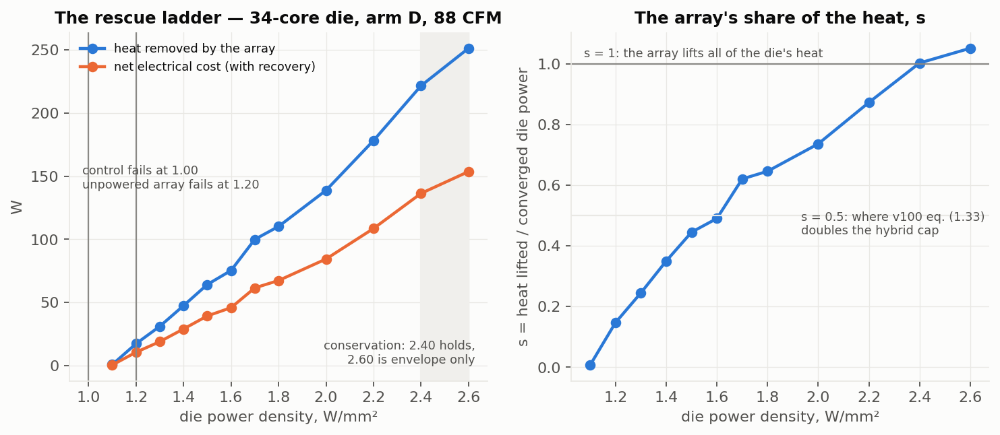

**4.2 The structural constants.** Pitch: 50 / 100 / 200 µm cost 19.476 / 19.476 / 19.470 W — a plateau set by the 200 µm of silicon between the tiles and the transistors; coarser than 200 µm degrades. Coverage: 26 % of the pixel layer's area (644 of 1126 blocks under gaps) holds the same rung on the same minimum plan within 1.6 %. Extractor: 0 tiles capped at every rung by the target device; max steady demand 5.3 W/mm² (accelerator) and 41 W/mm² only at quarter coverage; the coldest tile ever driven is 263 K.

**4.3 Clock as the free variable (F1c).** At 1.00 W/mm² the package clocks the die down to 3.66 GHz; the laser runs it at the device ceiling 4.17 GHz (+14 %, 38 W removed); +26 % at 1.20 (78 W); on the shipped 5 GHz table 4.86 GHz (+34 %, 235 W removed, thermally limited at 2.28 W/mm²). GFLOP/s per package watt falls with clock on every arm (`clock_f1c_density.json`).

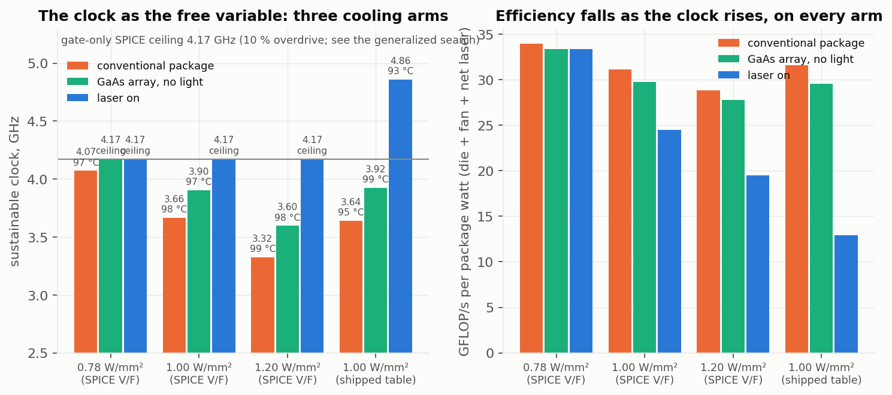

**4.4 Dark-silicon recovery (F2).** At 1.2 W/mm² per core: control 0 % of cores, unpowered layer 25 %, laser 100 % for **11.6 W**; at 1.5, only the laser lights any fraction (**44 W**; a lit quarter 4.1 W). Hot cores contiguous (worst case). These are the per-block envelope plans of §P0.29 (13 Sep): the seed-shape plans first recorded (17.3 / 64.2 / 48.7 W) held but over-spent by up to 12× on a concentrated quarter, and the one row the recorded figure showed as "runaway" at 1.2 W/mm² / 25 % was an unfinished six-iteration descent that holds for 0.8 W with twelve (`dark_silicon.json`).

**4.5 Burst absorption (F4).** A 10 ms burst of k× dynamic power, feed-forward modulation from the power monitor: overshoot per added watt 0.51–0.67 K/W (package), 0.51–0.54 (static array), **0.17–0.20 (modulated)**; at 0.80 W/mm² a 2× burst is held under the 92 °C target (package: 118 °C, 11 ms above spec); a 3× burst 1 K under the spec; at 1.00 W/mm² with 3 K of margin the modulated array crosses the target at every k and the spec at k ≥ 2; the static array runs away inside the window at 1.00/3×. Tile flux up to 13 W/mm² for 10 ms (`burst_absorption.json`).

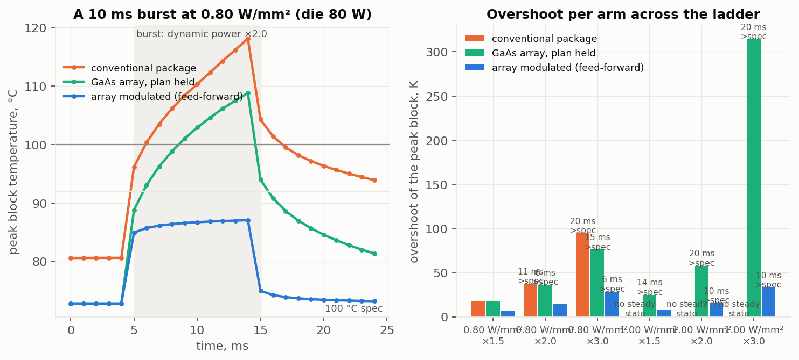

**4.6 The dense execution cluster (D1, X3).** Execution units at ×0.5 / ×0.25 area (2× / 4× W/mm²): the laser holds every reference rung to 202 W / 162 W at matched die watts, 0 tiles capped, cALU the peak block everywhere; plan 1.17–2.8× (×0.5) and 1.65–6.9× (×0.25) the reference's; the passive ceiling falls (50.5 / 45.5 W vs 60.7). At the book's 70 % utilisation and 20 µm cache halos the cluster is 1.22× denser in silicon, holds all five rungs to 243 W, and costs 1.16–1.44× a same-utilisation reference at the die-wide rungs (`d1_exec_density_family_result.json`, `x3_utilisation.json`).

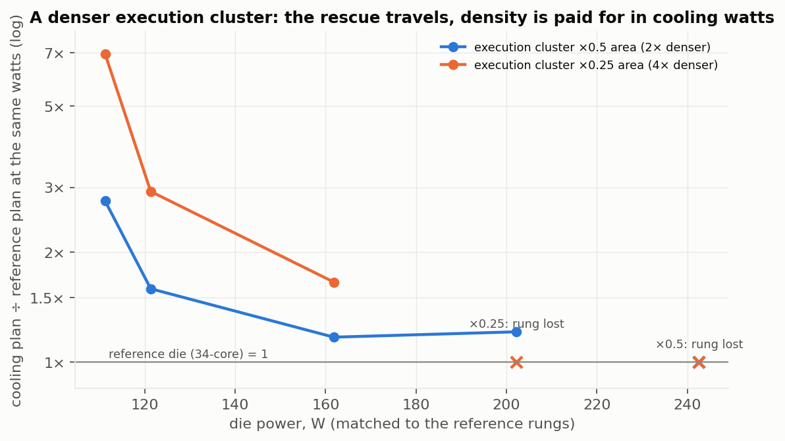

**4.7 The non-thermal end (X1, X2).** Re-solving the recorded fields as current densities at 0.70 V: die current 1.29 / 1.54 / 2.00 / 2.45 / 2.88× the native die's at 1.00 / 1.20 / 1.60 / 2.00 / 2.40 W/mm²; the ×0.5 cluster's cALU exactly 2.00× the reference's at matched watts (×0.25: 3.9×); Black's-law acceleration of the worst block vs native 12–50× along the ladder (n = 2, E_a = 0.9 eV stated); the cooling dividend at matched power 2.4×; on the SPICE clock rungs the cooled design's worst block outlives the control's 2.7–3.2× while clocking 14–26 % faster. Core-domain thermal gradient 24 K (native) → 32 / 40 / 50 / 60 K along the ladder; at a stated 150 ps insertion delay 3.2 → 4.2 / 5.3 / 6.6 / 7.9 % of the period; uniformity buys 0.74 % at matched power and the laser field is the *less* uniform one at matched density (`pdn_em_skew.json`).

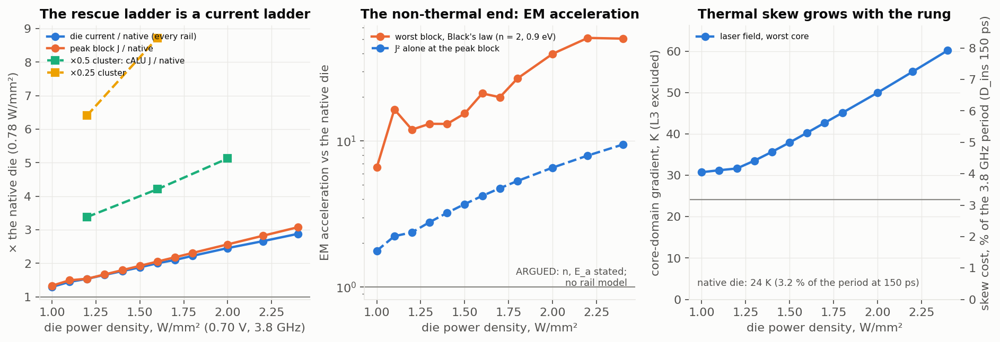

**4.8 Cooling the cache.** The prize is 2.23× larger than the project's original leakage curve implied and saturates by 280 K; on the compute die, holding the caches at 280 K costs the whole die's heat (99 W plan on a 99 W die) and 300 K costs ≥ 71 W (77 %); cache leakage 2.7× / 3.6× down; Cr:LiSAF on the cache tiles caps 56 tiles, 18 W short (`cold_zone_prize_*.json`, `d3_cache_objective.json`). **The two-die stack with the storage die on the sink side reproduces these numbers to three figures at every bond conductivity** (99.3 W; Cr:LiSAF 73.7 W with 58 tiles capped) and at an isolating bond the compute die loses its sink (`gen3_stack.json`, 11 Sep).

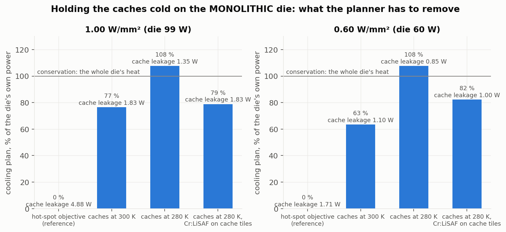

**4.9 The accelerator.** GA100-class die on a direct-die microchannel plate: the conventional stack has no steady state at 700 W on the simulated curve (assumed 25 % leakage split; uncalibrated); the unpowered GaAs layer holds 700 W; the laser holds 700 → 2600 W (s = 0.98 at the top); an eight-SM concentrated kernel at 700 W held for 32 W; max tile flux 5.3 W/mm² (`accel_f3_power_tol1.json`).

**4.11 The cooling-system ledger (13 Sep).** The ambient the conventional air package needs, and the inlet a chilled direct-die liquid plate (0.125 K/W) needs, to hold the die at each rescue rung, measured on the coupled solve and priced with LCEstimator's chiller and HVAC models: air needs 273 K at 1.20 W/mm², 243 K at 1.60, and has no solution above; the plate needs 293 / 273 / 263 / 243 K at 1.20 / 1.60 / 2.00 / 2.40. System COP (die watts over fan + pump + chiller + net laser): air 1.65 / 0.52 / — / —; liquid 17.3 / 3.94 / 3.02 / 0.97; photonic 2.59 / 1.90 / 1.58 / 1.29. The laser beats refrigerated air at every rung and is the only solution above 1.60; it beats the chilled plate only at 2.40, where the plate's coolant is −30 °C (`cooling_system_ledger.json`). The photonic plans are the seed-shape upper bounds; a per-block re-plan of the ladder is running.

**4.10 Falsification.** The 70-core die (196 mm², same core): the gen-0 ratios travel (concentration penalty 1.42–1.59, cALU the runaway block) and the absolute ceilings do not (flat 0.65 / 0.70 vs 0.85 / 0.90; the laser's multiplier 2.2× vs 2.4×; 301 W held vs a 390–470 W prediction) (`d4_falsification_70core.json`, `iso_package_throughput.json`).

---

## 5. What was argued and then falsified — the list counsel should know

These are the statements that lived in earlier drafts, the provisional, or the device book, and that the programme has measured to be wrong. Each has a replacement.

| withdrawn | replacement |
|---|---|
| A monolithic die can be zoned hot and cold | 40 W of removal buys 1.24 K of lateral gradient; the cold zone has to be a separate die |
| A storage die between the compute die and the sink collects the cache prize cheaply (the ladder's 9 Sep gen-3 design) | the storage die must be off the compute die's heat path (two sinks, or 2.5D beside it) |
| Uniformity is a clock lever (flattening the die buys 1–3 % of clock) | skew grows with the rung; the laser field is the less uniform one at matched density |
| The accelerator is where the extractor's rungs matter | the device is 150× under-used on the accelerator too |
| "N× the compute" from a fixed-core-count ladder | the watts multiplier (3.8× on the 34-core package) and the core-count multiplier (2.06× on the 70-core) are the quotable ones |
| The cold-zone prize is 30 % of die power | ~6–14 % (accounting-dependent); quote the 2.23× ratio and the 280 K knee |
| Yb:YLF is the cold-zone material; η_ASF ≈ 0.02 is the state of the art | Cr:LiSAF (storage) and the SMILES-R640 dye (hot); films > 1000 W/mm², η_ASF 0.10–0.60 |
| Recovery crosses to export at 408 K | 614 K (90 % laser preset); 408 K is self-powering, pump covered, LPC not counted |
| The part never reaches its 100 °C spec, it runs away first | it reaches spec at every cooling point tested; the clocks stand |
| The flat-die ceiling is 1.0–1.2 W/mm² | 0.85–0.90 |
| The V_t lever costs 22 K per 50 mV | 45–60 K per 50 mV on the simulated device; only 25 mV is inside the demonstrated lift |
| The array's own area makes every ceiling optimistic | the tiles sit above the silicon; the coverage charge is zero at the shipped pitch |

---

## 6. Recommended framing for the specific claims

The recommendation is to build the independent claims on what is measured, to carry the measured constants as dependent limitations (they are non-obvious and they are ours), and to keep the long-horizon embodiments (hot compute zone, net export, ISA-level changes) in the specification as embodiments without numeric limitations. Counsel will judge claim form; the substance we can defend is below.

**6.1 The driven, planned array (apparatus).** A processor die; a photonic cooling layer of anti-Stokes tiles disposed above the die's back surface (not co-located with the transistors — the removal must cross the burial depth, which is what makes the burial depth a design variable); a pump source and per-tile optical gating; and a controller that (a) obtains a per-block temperature field from the die at its operating point, (b) derives per-block removal from the die's own thermal sensitivities, (c) projects the block plan onto the tiles by footprint, and (d) selects the minimum plan that keeps the die on its stable (cool) branch under an energy-conservation cap. Dependent: the plan is bisected between the largest failing and smallest holding plan; the cap is the die's converged dissipation; a per-tile capability cap from the extractor's own cooling curve; tile pitch ≥ 200 µm with the die's silicon thickness setting the plateau; areal coverage ≤ 30 % of the layer; the array's footprint imposing no logic-area charge. **Basis:** 4.1, 4.2 (MEASURED).

**6.2 The distinguishing fact.** Wherever a claim recites the cooling effect, recite it as the *difference between the driven array and an undriven layer of the same material*: the undriven layer fails at 1.20 W/mm² where the driven one holds to 2.40. That difference is what separates the invention from "a thin conductive film on the die", and it is the fact measured 35 of 35 times. **Basis:** 4.1.

**6.3 Clock control to the device ceiling (method).** Operating the die under a thermal limit, bisecting the clock with dynamic power ∝ V²f on the device's V/F curve and leakage on the coupled solve, driving the array to hold the limit, and stopping at the transistor's ceiling rather than at the package's thermal ceiling — where, as of 13 Sep (§P0.31), that ceiling is **the supply at which the worst block's lifetime equals the qualification point's** (electromigration and dielectric breakdown, Arrhenius in the *cooled* temperature) on a period that includes wire, thermal skew and setup/jitter: the array's target temperature is then the co-design knob (each 30 K it holds below the corner buys ~6 % of supply), and the claim should recite the budget, not a fixed overdrive. Dependent: the operating point stated in W/mm²; the array removing 38–235 W to hold it. **Basis:** 4.3. **Do not** recite a GHz above the ceiling.

**6.4 Dark-silicon recovery (method).** At a per-core power density the package cannot hold for any contiguous fraction of cores, routing cooling to the active cores so that all cores are lit; the laser cost scaling with the lit fraction and the hot-spot geometry. **Basis:** 4.4.

**6.5 Feed-forward burst absorption (method).** A power monitor reporting per-block dynamic power; during a transient increase, the controller commanding the tiles above the affected blocks to remove the *added* watts at their source for the duration of the transient; the array's response (microseconds) being faster than the package's thermal mass (milliseconds), so the peak-block overshoot per added watt falls 2.5–3.3×. Dependent: modulation from a predictor of the transient (instruction queue, scheduler, branch predictor) as an *anticipatory* form — disclosed, not measured; the transient tile flux exceeding the steady demand (13 vs 5 W/mm²). **Basis:** 4.5 (feed-forward) — the branch-predictor form of the provisional's claims 2/8/14 should become a dependent embodiment of this claim.

**6.6 The co-designed die: dense cluster, re-sized rails, EM-budgeted target (architecture).** A die whose execution cluster (complex ALU, integer ALU, FPU, vector unit) is placed at 1.2–4× the power density a conventional package can hold, under the array's tiles, with the caches unchanged; the power-distribution stripes over the cluster sized in proportion to the cluster's current-density ratio (2× / 4× at the McPAT areas, 1.22× at 70 % utilisation); the array's target temperature chosen on an electromigration budget rather than the thermal specification; per-core clock domains where the array's uniformity does not suffice. **Basis:** 4.6 and 4.7 (MEASURED as current density and gradient; the rail *limit* and the EM lifetime ARGUED with n and E_a stated). This is the first architectural change made because of a measurement and re-measured, and it is the claim that most cleanly reads on "architectures enabled by" cooling.

**6.7 The storage die off the heat path (architecture, ARGUED).** A compute die with its dye tile array and sink on one face; a storage die carrying the level-2/level-3 caches on the other side of an interface that conducts only laterally (2.5D beside the compute die, or on the compute die's far face with its own sink), the storage die held near 280 K by chromium-doped extractor tiles; the cache leakage falling 2.7–3.6×. **Explicitly excluded** in the specification: the storage die between the compute die and the sink (measured: costs the whole die at every bond conductivity). **Basis:** 4.8 (constraint MEASURED; the design ARGUED). We recommend this be claimed as an embodiment with the falsified geometry disclaimed, since the disclaimer is itself evidence of non-obviousness.

**6.8 Low-V_th cells under the array (dependent, ARGUED).** Execution-cluster cells at a threshold 25 mV below the rest of the die, the array holding the cluster 22–30 K cooler to pay the leakage; +7.6 % clock on the cluster. **Basis:** SPICE-derived, not run end to end.

**6.9 Zone materials (dependent).** Storage-zone tiles of Cr:LiSAF; hot-zone tiles of a SiN-encapsulated molecular dye or GaAs; no rare-earth crystal; the storage-zone tile capability stated as a ceiling at unit external quantum efficiency. **Basis:** register §1.5; v100 §8.

**6.10 The accelerator embodiment (dependent).** A GPU-class die on a direct-die microchannel plate with the array between; a concentrated kernel held for a plan an order of magnitude below the kernel's added power; the array's plan shaped per block by the block's own dissipation. **Basis:** 4.9 (with the assumed-leakage caveat stated).

**What we recommend not claiming with numbers:** > 1000 W/mm² functional units; > 10 GHz; > 10¹¹ transistors/cm²; 160 °C reductions; > 10× COP; > 20–30 % recovery or net generation; > 1024-bit vectors and 16× FLOP; > 3× pipeline throughput; sub-10 °C variance on analog units.

---

## 7. How core designs evolve with targeted laser cooling — the figures

`figures/fig_integration_levels.png` (cross-sections by degree of integration), `figures/fig_core_evolution.png` (one core's floorplan per ladder generation), `figures/fig_scales.png` (the scale ladder and what is measured at each), `figures/fig_evidence_matrix.png` (the status of every claim-relevant statement), **the patent-style drawings `figures/pat_fig1–8.png` (Section 7A, 13 Sep)**, and the evidence figures `figures/ev_*.png` (the rescue ladder and s, the current ladder and EM acceleration, the dense cluster, the cache objective, the burst, the clock, dark silicon, the density ceilings, the cold-zone prize, the accelerator).

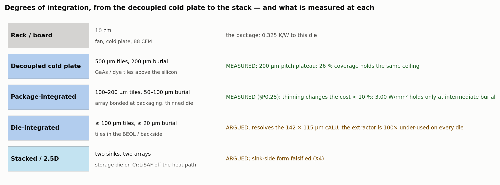

**Level 0 — the conventional direct-die part (gen 0).** The die a package can hold. Binding constraint: leakage runaway through the hottest complex-ALU (29 W/mm² on a die averaging under 1). Concentrating power costs 1.4× of ceiling, so a conventional floorplan spreads the execution units out; the traced die at its native 0.78 W/mm² has no steady state on this package under the corrected inputs. MEASURED.

**Level 1 — a decoupled photonic cold plate mounted on the direct-die part.** Nothing in the die changes; 500 µm tiles at 200 µm burial replace the 30 µm of grease under the same cold plate and fan. The laser buys the instability first (the hybrid cap beats 1/(1−s)), then the rungs to 3.50 W/mm² (per-block planner; conservation ends it there); clock to the device's ceiling; every core lit at 1.2 W/mm² per core for 12 W; a 2× burst held under target. The film is two orders of magnitude under-used, so the array's geometry is loose: 200 µm pitch and 26 % coverage suffice. This is the retrofit level of v100 §10.11 and it is where the measured record is deepest. MEASURED.

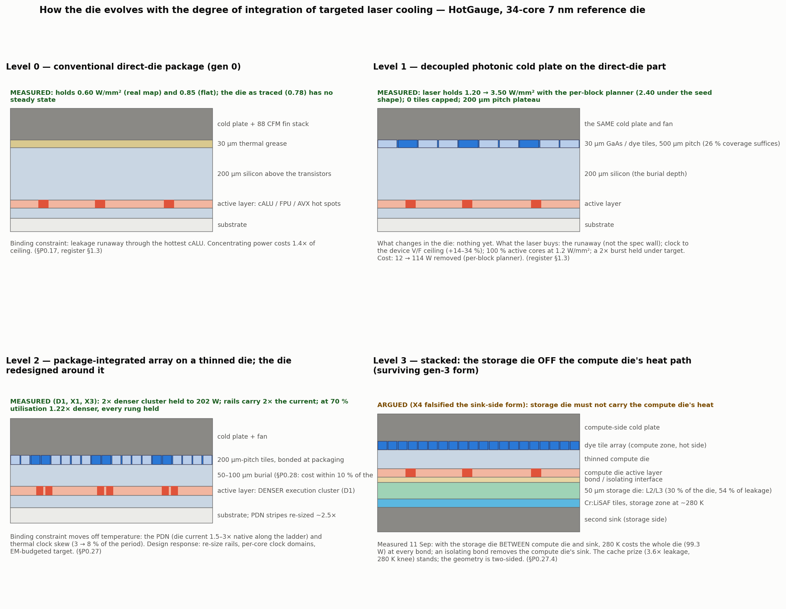

**Level 2 — the package-integrated array on a thinned die, and the die redesigned around it.** Tiles bonded at packaging at 100–200 µm pitch over 50–100 µm of silicon. The integration ladder of Section 8 measured what thinning buys in cooling cost: little (±10 %), with a shallow optimum near 100 µm; the value of integration is structural, not thermal. The die changes for the first time: the execution cluster densifies under the tiles (2× / 4× at fixed power; 1.22× at realistic utilisation), the rails over it are re-sized in proportion, the target temperature is chosen on an electromigration budget, and the clock tree is split into per-core domains because the gradient grows with every rung. The binding constraint has moved off temperature: it is the PDN, then skew. MEASURED (D1, X1, X2, X3) as densities, currents and gradients; ARGUED as limits.

**Level 3 — the stack.** The cache prize (2.23×, 280 K knee) can be collected only where the storage die is off the compute die's heat path: a two-sided stack (dye array and sink on the compute face, Cr:LiSAF tiles and a second sink on the storage face) or a 2.5D placement beside the compute die. The sink-side form is measured and falsified. ARGUED, with the next experiment named.

**Beyond level 3 (not claimed with numbers).** A hot compute zone (500–600 K) needs refractory metallization and wide-bandgap devices before it needs cooling; the recovery loop's export crossing is 614 K on the device model. These are the book's Tier-III embodiments and belong in the specification as the long-horizon direction, without percentages.

**The evolution ladder, one change per measured constraint.** Gen 0 (runaway through the cALU) → gen 1 (densify the cluster; what binds next is the rails) → gen 2 (low-V_th cells under the array; what binds next is the laser budget) → gen 3 (the storage die off the heat path; what binds next is interface isolation and two-sided packaging, which are not thermal). The ladder ends where its constraint stops being thermal, and on the reference die that is at gen 1's rails.

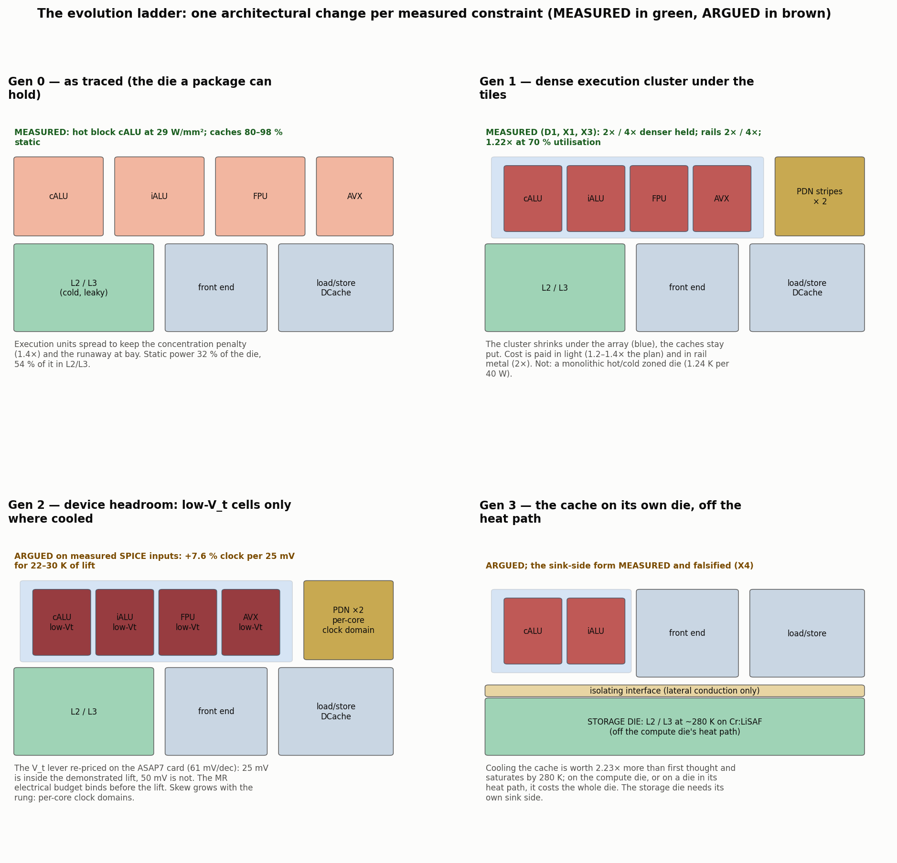

---

## 7A. Patent-style drawings: the core evolved in response to localized, high-power-density cooling (13 Sep)

Eight monochrome sheets with reference numerals, drawn by `make_patent_figures.py` from the real floorplans (`examples/floorplans/outputs/…`, one core of the 34-core die at 1×, 1/2, 1/4, 1/8 and 1/16 execution-unit area), the recorded fields and the evidence JSONs where a number appears. Every caption states MEASURED or ARGUED per the register; nothing in a drawing is claimed beyond its caption. The argument they carry, in order: the conventional core is bounded by a leakage runaway through its hottest execution unit and spreads that unit out to survive (FIG. 1); a driven, planner-commanded tile array above the back surface removes the runaway first and then the rungs to conservation (FIG. 2); the execution cluster can then be made 2–16× denser at unchanged power, with the tile pitch matched to the unit (FIG. 3); the rails over it are widened in proportion to its current density and the array's target is chosen on a lifetime budget, which is the co-design knob for supply and clock (FIG. 4); at fine pitch and the top rung the film's own cold end binds, which fixes the tile pitch and the hot-zone material as design variables (FIG. 5); the caches are collected on a storage die off the compute die's heat path (FIG. 6); the composed core (FIG. 7); and the ladder of constraint → cooling → response → next constraint that generated it (FIG. 8).

**Reference numerals.**

| numeral | element | first figure |
|---|---|---|
| 100 | core as traced (gen 0) | FIG. 1 |
| 110 | execution cluster | FIG. 1 |
| 112 | complex ALU (the worst block) | FIG. 1 |
| 114 | integer ALU | FIG. 1 |
| 116 | floating-point units | FIG. 1 |
| 118 | vector (AVX) units | FIG. 1 |
| 120 | L2 cache | FIG. 1 |
| 122 | L3 slice | FIG. 1 |
| 124 | data cache | FIG. 1 |
| 126 | instruction cache | FIG. 1 |
| 130 | front end / scheduler | FIG. 1 |
| 140 | control slab | FIG. 1 |
| 200 | substrate and bumps | FIG. 1 |
| 202 | active layer | FIG. 1 |
| 204 | silicon above the transistors (burial depth) | FIG. 1 |
| 206 | thermal interface material | FIG. 1 |
| 208 | cold plate | FIG. 1 |
| 210 | fin stack and fan | FIG. 1 |
| 300 | photonic cooling layer (tile array) | FIG. 2 |
| 302 | anti-Stokes tile (GaAs or SiN-encapsulated dye, 30 µm) | FIG. 2 |
| 304 | pump waveguides and couplers | FIG. 2 |
| 306 | luminescence collector | FIG. 2 |
| 310 | controller | FIG. 2 |
| 312 | sensing: per-tile temperature | FIG. 2 |
| 314 | planner: minimum plan on the cool branch under the conservation cap | FIG. 2 |
| 316 | per-tile pump drive | FIG. 2 |
| 110′ … 110″″ | the execution cluster at 2×, 4×, 8×, 16× density | FIG. 3 |
| 400 | power-distribution stripes (top metal) | FIG. 4 |
| 402 | stripes widened ~J× over the dense cluster | FIG. 4 |
| 410 | target temperature chosen on the lifetime budget | FIG. 4 |
| 110″ | the 16× (460 W/mm²) execution unit | FIG. 5 |
| 502 | tile pitch matched to the unit | FIG. 5 |
| 504 | cold-tolerant hot-zone tile material over the cluster | FIG. 5 |
| 506 | dual-material tile layout | FIG. 5 |
| 508 | coarse pitch, conservation-bound | FIG. 5 |
| 610 | storage die (L2 / L3 caches) | FIG. 6 |
| 612 | Cr:LiSAF storage-zone tiles (~280 K) | FIG. 6 |
| 614 | second sink, storage side | FIG. 6 |
| 620 | bond / isolating interface | FIG. 6 |
| 630 | interposer | FIG. 6 |
| 632 | isolating channel | FIG. 6 |
| 100′ | the evolved core | FIG. 7 |
| 700 | low-threshold cells restricted to the cooled cluster (ARGUED) | FIG. 7 |

`[!]` What the drawings do not show: a rail model (402 is a current-density statement), the two-sink stack solved (FIG. 6b/c are the next build), the 16× unit at a grid that resolves it (its holds are lower bounds), and anything above 3.50 W/mm² on the reference die.

## 8. Experiments run for this memo

**The integration ladder (§P0.28, launched 12 Sep, 41 points on the allocation).** Burial depth 200 → 100 → 50 → 20 µm and tile pitch 500 / 200 µm on the reference die at 1.20, 2.00, 2.40, 2.60 and 3.00 W/mm², 100 µm grid, against the 100 µm reference at 200 µm / 500 µm. Predictions written before the run: the plan at 2.00 falls 10–25 % at 20 µm; 2.60 holds at ≤ 50 µm and 3.00 holds nowhere (conservation); pitch is inert at 200 µm burial and worth 10–20 % at 20 µm; the passive cliff does not move; the peak tile flux rises to 5–10 W/mm². Results in Section 8.1: P1–P3 falsified — the cost does not fall with integration. This is the measurement behind the Level 1 → Level 2 step of Section 7.

**The cooling-system ledger (§P0.30, 13 Sep, 60 control points).** See 4.11: the COP comparison the provisional's >10× rested on, re-run on the coupled solve — the answer is a curve against rescue depth with the air and liquid cases separated. **The dark-silicon correction (§P0.29, 13 Sep, 9 points).** The recorded "runaway" at 1.2 W/mm² / 25 % was an unfinished planner descent (holds for 0.8 W); the per-block envelope shape lowers every F2 cost (17.3 → 11.6 W at 1.2; 64.2 → 44 W at 1.5).

**The generalized f_max and the densified-cluster ladder (§P0.31–§P0.32, 13 Sep).** (a) A period model with wire, thermal skew (read from each solve) and setup/jitter, anchored once at the trace, with V_max from an Arrhenius reliability budget (EM Black n = 2 / 0.9 eV, TDDB power law n = 40 / 0.6 eV; the qualification point 0.77 V at 100 °C restated): at the 92 °C target the overdrive buys +1.6 % of clock, at 60 °C +8 %, at 27 °C +16 %; TDDB binds at every temperature below the corner; 10 GHz needs a 6–7 FO4 pipeline (`docs/evidence/fmax_model.json`; the coupled search `clock_fmax.json`). (b) The 8× / 16× execution clusters (230 / 460 W/mm² cALUs) at 20 µm and 5 µm burial and 200 / 100 µm pitch, matched die watts, per-block shape: the 8× holds to 202 W everywhere, the 16× only at 100 µm pitch; the top rung is lost to conservation (coarse pitch) or to the dye's cold end (fine pitch: tiles at 253–254 K asked for 170–200 W/mm²) — the first rows where the film binds; premium 1.8–1.9× over the reference at the same geometry; and the reference itself is 14–31 % cheaper at 5–20 µm burial than at 200 µm under this shape (`docs/evidence/cluster_transport.json`).

**Recommended next experiments (not run):** the two-sided gen-3 stack (3D-ICE's bottom heat sink makes it buildable; a second array die and its wiring are the work); a rail model so "binds: PDN" becomes a supply-voltage term in the clock search; the anticipatory (predictor-driven) form of burst modulation against the feed-forward form; a second workload class.

### 8.1 Integration-ladder results (landed 12 Sep; `figures/fig_integration_ladder.png`, `results/integration_ladder.json`)

| burial above the transistors | tile pitch | plan at 2.00 W/mm² | 2.40 | 2.60 | 3.00 |
|---|---|---|---|---|---|
| 200 µm (the decoupled cold plate; reference) | 500 µm | **126 W** | 205 | 233 | no steady state |
| 200 µm | 200 µm | 121 | 197 | 233 | no steady state |
| 100 µm | 500 µm | **113** | 183 | 215 | **289 W, held** |
| 100 µm | 200 µm | 115 | 183 | 215 | 271, held |
| 50 µm | 500 µm | 119 | 191 | 228 | hot branch, not held |
| 50 µm | 200 µm | 114 | 181 | 213 | 278, held |
| 20 µm (die-integrated) | 500 µm | **131** | 209 | 243 | no steady state |
| 20 µm | 200 µm | 122 | 200 | 227 | hot branch, not held |

**Superseded in part on 13 Sep (§P0.32): this ladder ran the planner's uniform "seed" envelope shape; under the per-block shape the reference's plans at 20 µm and 5 µm burial are 14–31 % BELOW the 200 µm-burial plans (202 W: 78–97 W against 114; 243 W: 139–160 against 177, at 100–200 µm pitch), so the "no thermal advantage from integration" reading below is the seed planner's, not the die's. The structural reading (claim the decoupled form as an embodiment) stands.**

**What it says (seed shape, as run).** The rescue cost is insensitive to how close the tiles sit to the transistors: from the decoupled cold plate (200 µm of silicon between tiles and active layer) to a die-integrated array (20 µm) the plan at 2.00 W/mm² moves within ±10 %, with a shallow optimum near 100 µm, and thinning to 20 µm is *worse* by 4 % at 500 µm pitch. Finer pitch is worth 4 % at 200 µm burial and 7 % at 20 µm. The top rung is highest at intermediate burial (3.00 W/mm² holds at 100 µm and at 50 µm with 200 µm tiles; it has no steady state at 200 µm and at 20 µm with 500 µm tiles): thin enough for the tiles to reach the hot spots, thick enough to spread them. The maximum tile demand is set by the tile area and the rung, not by burial (5 W/mm² at 500 µm pitch, 8 at 200 µm at 2.00; 14.8 W/mm² at 3.00 with 200 µm tiles, the highest steady demand simulated, 55× under the film). The unpowered array diverges at 1.20 W/mm² at every burial: thinning the die moves nothing on the passive side; the rescue is the laser's. Predictions P1–P3 (a monotone fall in cost with integration) were falsified; P4 and P5 confirmed.

**Implication for the claims.** The decoupled cold plate on a standard-thickness direct-die part is not a compromised form of the invention; on this floorplan it is within 10 % of the fully integrated array in cost and holds the same rungs. That supports claiming the decoupled form factor as the primary embodiment, with package and die integration claimed for what they enable *structurally* (the two-sided stack of Section 6.7, the density co-design of Section 6.6, finer pitch where the silicon spreads less) rather than for a thermal advantage the simulations do not show. Caveats: 100 µm grid; the 3.00 W/mm² rows are under the injected energy cap; the planner's envelope shape is the uniform seed shape — **and the per-block shape does favour shallow burial and finer pitch (measured 13 Sep, §P0.32: −14 to −31 % at 5–20 µm), so "within 10 %" is withdrawn as a thermal statement; the decoupled form should be claimed as an embodiment, not as cost-equivalent.**

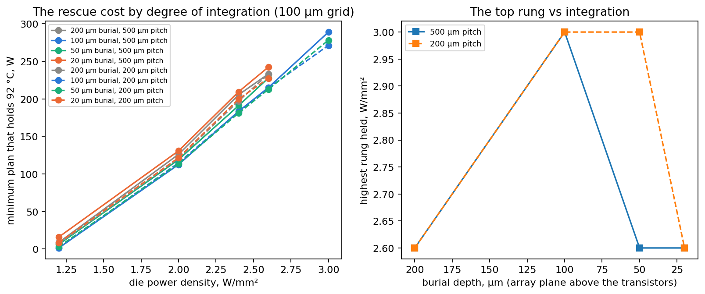

---

## 9. Appendix — evidence pointers and the standing rules

Every file named in Sections 4–5 is in `results/` (copied from `docs/evidence/`), with the register (`RESULTS_REGISTER.md`) that classifies them. Standing rules that bound every number:

- Two control ceilings exist (the density probe's shaped arm, 0.60–0.65; the driver's control arm, 0.88–1.00); say which.
- Every rung above ~1.3 W/mm² is a current statement as well as a thermal one.
- Steady per-tile demand never exceeds ~5 W/mm² on any die simulated; 13 W/mm² transient.
- Above ~127 °C report "non-viable", never a temperature.
- Sub-ambient figures are a bracket (two GIDL models), not a point.
- An unconverged solve is neither a hold nor a failure.
- MR costs are comparable across leakage curves only at a common peak.
- The floorplan-pack images are third-party subscriber content: numbers derived from them may be published, the plates may not.

Nothing here is a legal opinion; it is the technical record and our recommendation on which parts of it bear claims.

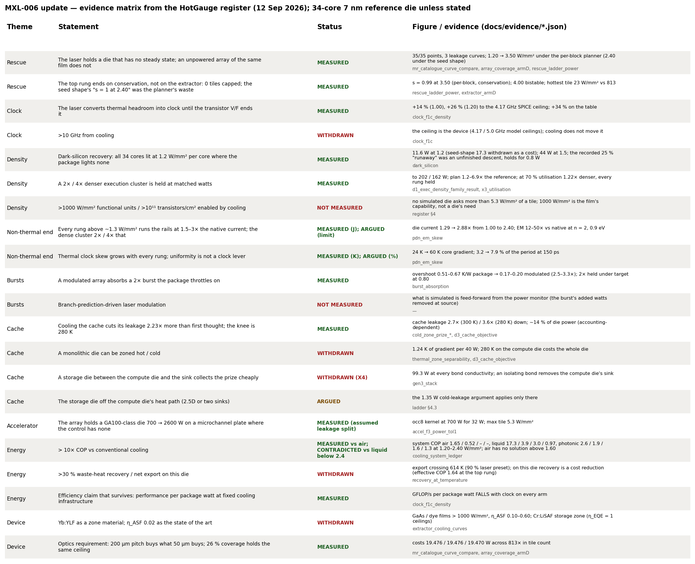

